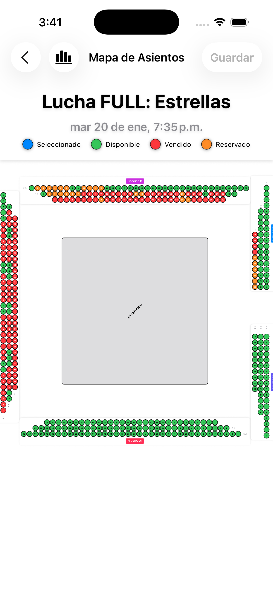
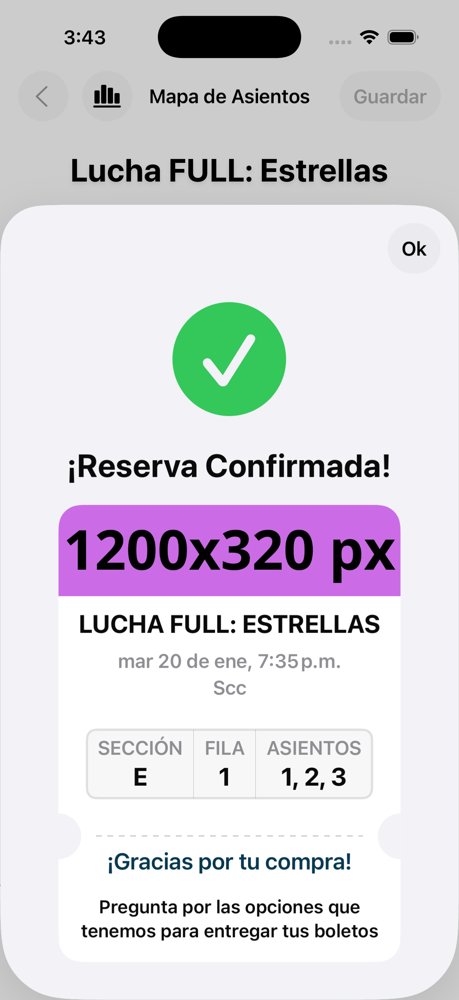
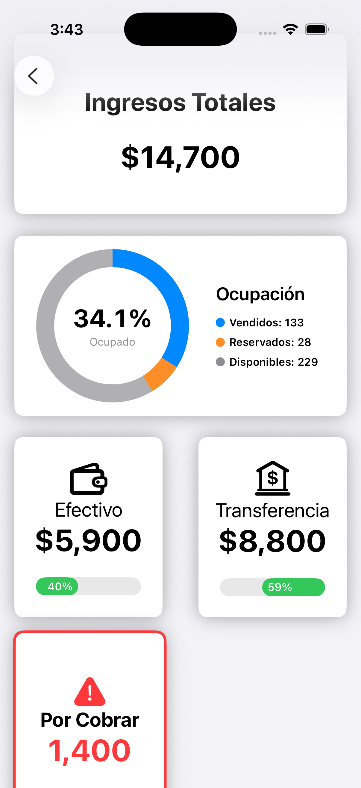

# Tessera: Event Seating & Management System

**Tessera** (Project Code: *GrupoSolis*) is a comprehensive iOS application designed for event organizers to manage venue seating, ticket sales, and real-time revenue analytics. It features a Ticketmaster-style interactive map allowing for precise seat selection, reservation management, and payment settlement using a robust Firebase backend.

  
  
  
  
  

##  Key Features

* **Interactive Seat Map:** A high-performance, zoomable, and pannable vector map built with SwiftUI. Supports complex venue layouts with distinct sections, rows, and stages.
* **Smart Contextual Bubbles:** Implemented a "Seat Detail Bubble" that acts as a contextual command center. It leverages conditional logic to dynamically toggle between payment processing and refund workflows, ensuring the user only sees valid operations for the selected seat.
* **Real-Time Seat Status:** Powered by Firestore listeners, the map updates instantly to reflect seat changes (Available, Selected, Reserved, Sold) across all devices, preventing double-bookings.
* **Reservation Settlement:** Dedicated workflows for converting "Reserved" seats into "Sold" tickets, supporting multiple payment methods (Cash, Bank Transfer) with accurate revenue tracking.
* **Financial Analytics:** A dynamic dashboard visualizing total revenue, occupancy rates, and sales breakdowns by payment method (Cash vs. Transfer).
* **Admin Controls:** Features for issuing refunds, releasing held seats back to the pool, and inspecting transaction details per seat.
* **Secure Authentication:** Role-based access control using Firebase Authentication.

##  Tech Stack

* **Language:** Swift 5+
* **UI Framework:** SwiftUI
* **Backend:** Firebase (Firestore, Auth)
* **Architecture:** MVVM (Model-View-ViewModel)
* **Concurrency:** Swift Concurrency (`async/await`) & Combine
* **Reactive Programming:** `@Published` properties and custom `ListenerRegistration` for real-time data binding.

##  Engineering Highlights

### The Zoomable Map Engine
Rendering hundreds of interactive seat nodes efficiently was a primary challenge. I implemented a custom `ZoomableScrollView` wrapper that handles:
* Coordinate space transformations for precise tap detection on zoomed-in elements.
* Efficient rendering of `Circle` shapes and overlays to maintain 60fps scrolling.
* Dynamic "Detail Bubbles" that appear contextually when a seat is inspected.

### Immutable State Management
To ensure data integrity within SwiftUI's declarative views, the app uses a strict unidirectional data flow. Instead of mutating `Seat` structs directly in the view layer (which causes conflict errors), the app uses a closure-based delegation pattern. Payment methods and status changes are passed as arguments from the UI components up to the `SeatMapViewModel`, ensuring the "source of truth" remains in the logic layer.

### Accurate Financial Reporting
The statistics engine implements defensive logic to prevent "ghost revenue." It filters transactions based on a combination of *Status* (`.sold` | `.reserved`) and *Payment Method*, ensuring that seats released or refunded (`.available`) are immediately deducted from the financial totals, regardless of their previous payment history.

##  Installation

1.  Clone the repository.
2.  Add your `GoogleService-Info.plist` file to the `App` folder (Required for Firebase connection).
3.  Open `GrupoSolis.xcodeproj` in Xcode 15+.
4.  Ensure iOS Target is set to 16.0 or higher.
5.  Build and run on Simulator or Device.

---
*Created by Leonardo Solis - 2025*
